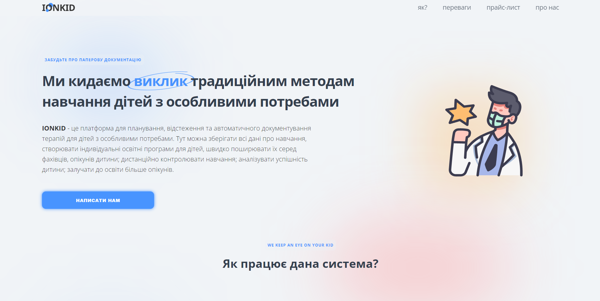

# IonKid landing page

## [GitHub Pages](https://wordllban.github.io/ionkid-landing/)

### Technology stack

# Relative Links

### [IonKid Project](https://www.linkedin.com/company/ionkid/)
### [Design](https://www.figma.com/file/cwMqRXIWKhJK9ECXfkluDs/IONKID)